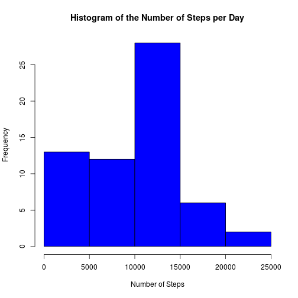
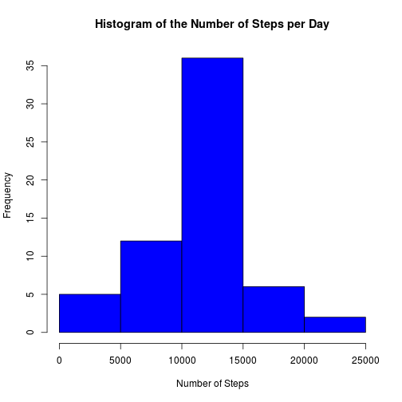
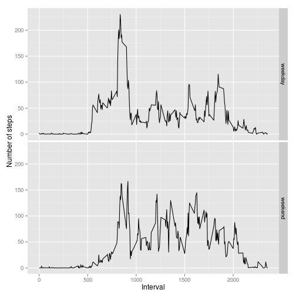

# Reproducible Research: Peer Assessment 1

## Loading and preprocessing the data

First we read in the data table file and remove all entries for which the number of steps record is missing.


```r
datInWithNA <- read.csv("activity.csv",header=TRUE)
datIn <- datInWithNA[!is.na(datInWithNA$steps),]
```

The data is then processed to sum over number of steps records on any given day.

```r
dateSplit <- split(datIn,datIn$date)
stepsSum <- sapply(dateSplit, function(x) colSums(x["steps"]))
```

As a second approach, the mean number of steps in a given time interval is found using the following code.


```r
intervalSplit <- split(datIn,datIn$interval)
datIntervalMean <- data.frame(steps=sapply(intervalSplit, function(x) colMeans(x["steps"])),
                              interval=as.numeric(names(intervalSplit)))
```


## What is mean total number of steps taken per day?

For a first pass at this question we construct a histogram of the number of steps recorded per day.

```r
hist(stepsSum, 
     main="Histogram of the Number of Steps per Day",
     xlab="Number of Steps",
     col="blue")
```

 

The mean and median number of steps taken per day are then caluclated with the following code.

```r
meanSteps <- mean(stepsSum)
medianSteps <- median(stepsSum)
```
From this code we find the mean number of steps to be 9354.2295 and the median value is 1.0395 &times; 10<sup>4</sup> steps.

## What is the average daily activity pattern?

The average daily activity pattern may be represented as a plot of the average number of steps taken in a given five minute interval over the course of a day.

```r
plot(datIntervalMean$interval,datIntervalMean$steps,
     type="l",
     xlab="Five Minute Time Interval",
     ylab="Mean Number of Steps")
```

 

The five minute interval with the highest average number of steps is found as follows.

```r
maxID <- datIntervalMean[which.max(datIntervalMean$steps),"interval"]
```
The result of this computation is that the highest average number of steps taken occurs during the interval beginning at minute 835.

## Imputing missing values

The raw data set contains a total of 2304 entries with missing step counts.

In this section the missing step count entries are replaced with the average step count for the corresponding five minute interval across all dates.


```r
datInReplacedNA <- datInWithNA
indexNA <- is.na(datInWithNA$steps)
NindexNA <- seq_along(indexNA)[indexNA]
indexIntervals <- datInWithNA[indexNA,"interval"]
for (i in seq_along(NindexNA)) {
        datInReplacedNA[NindexNA[i],"steps"] <- datIntervalMean[
                datIntervalMean$interval==indexIntervals[i],"steps"]
}
```

With this data set the initial analysis maybe be repeated to examine the affect of the missing step counts entries.


```r
dateSplitRNA <- split(datInReplacedNA,datInReplacedNA$date)
stepsSumRNA <- sapply(dateSplitRNA, function(x) colSums(x["steps"]))

hist(stepsSumRNA, 
     main="Histogram of the Number of Steps per Day",
     xlab="Number of Steps",
     col="blue")
```

 

```r
meanStepsRNA <- mean(stepsSumRNA)
medianStepsRNA <- median(stepsSumRNA)
```

The mean and median daily step values for this missing data replaced set are 1.0766 &times; 10<sup>4</sup> and 1.0766 &times; 10<sup>4</sup> respectively.  By replacing the missing values the mean and median
step counts have changed by 1411.9592 and 371.1887 counts.

## Are there differences in activity patterns between weekdays and weekends?

To examine the difference in the activity pattern between weekdays and weekends, a factor needs to be added to the missing value replaced data frame.


```r
datInReplacedNA$dateType <- ifelse(weekdays(as.POSIXlt(datInReplacedNA$dat)) %in%
                                           c("Saturday","Sunday")
                                   ,"weekend","weekday")
```

Using this new factor the data is then separted in weekday and weekend sets, and averaged along the five minute interval.


```r
datWeekday <- datInReplacedNA[datInReplacedNA$dateType == "weekday",]
datWeekend <- datInReplacedNA[datInReplacedNA$dateType == "weekend",]

WDintervalSplit <- split(datWeekday,datWeekday$interval)
WDIntervalMean <- data.frame(steps=sapply(WDintervalSplit, function(x) colMeans(x["steps"])),
                              interval=as.numeric(names(WDintervalSplit)),dateType='weekday')

WEintervalSplit <- split(datWeekend,datWeekend$interval)
WEIntervalMean <- data.frame(steps=sapply(WEintervalSplit, function(x) colMeans(x["steps"])),
                              interval=as.numeric(names(WEintervalSplit)),dateType='weekend')

WDEIntervalMean <- rbind(WDIntervalMean,WEIntervalMean)
```

Then a plot is constructed of the average interval activity levels for both weekdays and weekends.


```r
library(ggplot2)
qplot(interval, steps, data=WDEIntervalMean,
      geom = 'line',
      facets= dateType ~ . ,
      xlab='Interval',
      ylab='Number of steps')
```

 
